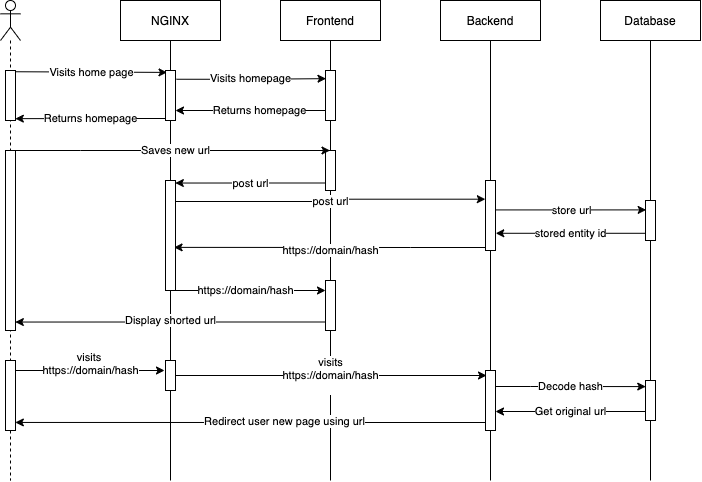

# URL Shortener
## Environment files

### Test and Development
- Before running any command, make sure that ./env/{test, dev}.env file exists
- If running in test environment, set NODE_ENV and HASH_SALT values to "test", TYPEORM_SYNCRONIZE = true and TYPEORM_DATABASE = :memory:

      NODE_ENV =

      # APP settings
      HTTP_PORT = 8000
      HASH_SALT =

      # DB Settings 
      TYPEORM_CONNECTION = better-sqlite3
      TYPEORM_DATABASE = 
      TYPEORM_SYNCHRONIZE = 
      TYPEORM_ENTITIES = src/db/entity/*.ts
      TYPEORM_MIGRATIONS = src/db/migrations/*.ts
      TYPEORM_ENTITIES_DIR = src/db/entity
      TYPEORM_MIGRATIONS_DIR = src/db/migrations

### Production

- It is best practice to use environment variables or secrets at run-time (i.e. docker swarm / kubernetes), see: [secrets](https://docs.docker.com/engine/swarm/secrets/).
- Manually create the database from the schema and run migrations if necessary, either by using TypeORM or SQL file.

      HTTP_PORT = 8000
      HASH_SALT = prod
      NODE_ENV = production

      # DB Settings 
      TYPEORM_CONNECTION = better-sqlite3
      TYPEORM_DATABASE = build/db/storage/prod.db
      TYPEORM_ENTITIES = build/db/entity/*.js,modules/**/entity/*.js
      TYPEORM_MIGRATIONS_DIR = build/db/migration/
      TYPEORM_SYNCHRONIZE = false

## Commands

  Unit tests:
  
      make test
  
  End-to-end tests:

      make test-e2e
  
  Development environment:

      make dev

## Tech stack
### Backend

- Nodejs
- TypeScript
- TypeORM
- Sqlite3
- Jest
- Nginx as Reverse Proxy
- Docker
### Frontend

- React
- Tailwindcss
- TypeScript
- Jest
- Cypress
- Docker

## Sequence diagram

## System Design

There are many ways that one could have built an URL shortener.

**One:**

The first option could have been a Monolithic application where the server was responsible for the UI, API and Database requests, for example, NextJS.

**Two:**

The second option could have been to split the application into Frontend and Backend into different domains or servers. Plus, we could probably leverage a NoSQL database instead of a SQL one.

**Third:**

The third option, and this solution, was allowed to work from the same domain without coupling the Frontend and Backend. Uses NGINX as a reverse proxy that sits in front of both applications. Allows both applications to be developed and deployed independently. Unfortunately, our data is not relational. The best choice would have been a NoSQL database.

**Fourth:**

The fourth option splits both the FE and BE into different domains or servers, uses a hashing mechanism agnostic to IDs (SQL) or Document IDs (NoSQL), and uses a NoSQL database for fast reads. It could leverage caching using Redis.

## What have I learnt or improved upon

- Docker and Docker-Compose
- React Testing Library
- Cypress
- TypeORM (new)]
- Sqlite3
- NGINX
- Tailwindcss (new)

## What could have been improved
- Separate FE and BE unit tests from docker-compose.test.yml or check if any of the containers have exited, therefore exiting earlier before any other tests start.
- How host and scheme variables are set in the NGINX dev configuration file to make it work locally with the Backend is very hacky, therefore not recommended besides local development, theoretically should work in production but wasn't tested with a domain.
- Wait-for-it.sh script only checks for available TCP ports. It works well when working with a Backend or Database server but fails to check if the Frontend application is ready. The issue becomes apparent when running E2E tests Cypress might fail to run. By modifying the script to curl for the page before running Cypress would potentially fix this issue.
- Either use in Memory cache for the requests or Redis that would comply with the same caching interface, this would prevent hitting the database for every single request.