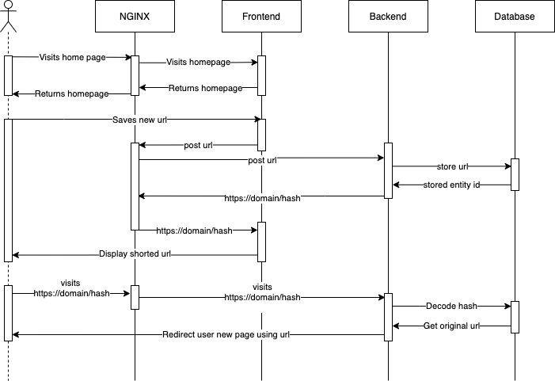

# URL Shortener
## Environment files

Before running any command, make sure that ./env/{name}.env file exists with the following variables set.
If running in test environment, NODE_ENV = test and HASH_SALT = test so tests don't fail.

    NODE_ENV =

    # APP settings
    HTTP_PORT = 8000
    HASH_SALT =

    # DB Settings 
    TYPEORM_CONNECTION = better-sqlite3
    TYPEORM_DATABASE = 
    TYPEORM_SYNCHRONIZE = 
    TYPEORM_ENTITIES = src/db/entity/*.ts
    TYPEORM_MIGRATIONS = src/db/migrations/*.ts
    TYPEORM_ENTITIES_DIR = src/db/entity
    TYPEORM_MIGRATIONS_DIR = src/db/migrations

## Commands

  Unit tests:
  
      make test
  
  End-to-end tests:

      make test-e2e
  
  Development environment:

      make dev

## Tech stack
### Backend

- Nodejs
- TypeScript
- TypeORM
- Sqlite3
- Jest
- Nginx as Reverse Proxy
- Docker
### Frontend

- React
- Tailwindcss
- TypeScript
- Jest
- Cypress
- Docker

## Sequence diagram

## System Design

There are many ways that one could have built an URL shortener.

**One:**

The first option could have been a Monolithic application where the server was responsible for the UI, API and Database requests, for example, NextJS.

**Two:**

The second option could have been to split the application into Frontend and Backend into different domains or servers. Plus, we could probably leverage a NoSQL database instead of a SQL one.

**Third:**

The third option, and this solution, was allowed to work from the same domain without coupling the Frontend and Backend. Uses NGINX as a reverse proxy that sits in front of both applications. Allows both applications to be developed and deployed independently. Unfortunately, our data is not relational. The best choice would have been a NoSQL database.

**Fourth:**

The fourth option splits both the FE and BE into different domains or servers, uses a hashing mechanism agnostic to IDs (SQL) or Document IDs (NoSQL), and uses a NoSQL database for fast reads. It could leverage caching using Redis.

## What have I learnt or improved upon

- Docker and Docker-Compose
- React Testing Library
- Cypress
- TypeORM (new)
- NGINX
- Tailwindcss (new)
